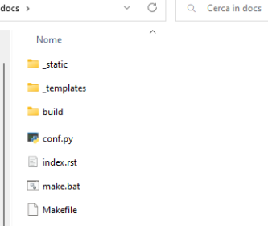

# How to create such a portfolio with Sphinx
[Sphinx](https://www.sphinx-doc.org/en/master/) helps you create documentation for developers.\
\
While it is natively thought for Python, it can be used to documet any programming languages. Also, since it creates static webpages, it can also be used to create your portfolio.\
\
This README file shows you how you can use Sphinx to create your portfolio, but the concepts can be extended to use it do create documentation for code.\

### Prerequisites: installing Python and virtual env
Whether you use Sphinx to creae your portfolio or to document your Java project, since this is natively thought for Python developers, you need to have Python installed on your machine because you'll need to modify a predefined Python file.\
\
At the time of writing (November 2023), Sphinx doesn't require any particular Python version but I reccomend to install the latest stable one.\
\
Here's how you can install Python:
- **On windows**. Follow [this guide](https://phoenixnap.com/kb/how-to-install-python-3-windows).
- **On Ubuntu**:

```bash
$ sudo apt update && sudo apt upgrade
$ sudo apr install pythonx.xx
$ sudo apt install pythonx.xx-venv
```

Note that `pythonx.xx` refers to a generic version of Python. If, for example, you want to install version 3.9 you'll have to modify the above code and write `python3.9`.

### Using Sphinx
Create a repository where your project will be stored and follow the steps.


**Step 1: create a virtual environment**

First of all, in the main folder, create and activate a virtual environment like so:

|   **Windows**                                          | **Ubuntu**                                                |
| :------:                                               | :-----------------------------------------------------:   |
| Create virtual environment: `> python -m venv venv`    | Create virtual environment: `$ python3 -m venv venv`      |
| Activate  virtual environment: `venv\Scripts\activate` | Activate  virtual environment: `source venv/bin/activate` |


**Step 2: create a `/docs` folder**
Create a `/docs` folder in the main folder. We'll use this for storing all the needed Sphinx files.\
\
So, the structure of your main folder now should be something like:

```bash
<your_main_folder>
    ├── docs
    ├── venv 
```


**Step 3: installing the needed libraries**

Install sphinx via:

```bash
python -m pip install sphinx
```

Install a theme from the [Sphinx gallery](https://sphinx-themes.org/). I used the theme "Furo" for my portfolio. You can install it via:

```bash
pip install furo
```

Sphinx natively uses ReSTructured text (more on that later) which is similar to markdown. However, since markdown is widely used (and since I prefere it) I used the [MyST parser](https://myst-parser.readthedocs.io/en/latest/) integration that allows us to use Sphinx with markdown instead of reSTructured text. Install it via:

```bash
pip install myst-parser
```

**Step 4: initialize Sphinx**

Go in the `/docs` folder and type:

```bash
sphinx-quickstart
```

to initialize Sphinx.\
\
You’ll be asked some questions. Answer as follows:
- separate source and build directories? → y
- project name → (the name of your project)
- Author name → (the name of the author)
- project release → 0.0
- project language → press ENTER to leave it as English (default)

Now the `/docs` folder has been populated with the files and subfolders by Sphinx.\
Copy all the files that are inside the `/source` folder in the `/docs` folder. Then, delete the folder `/source`.\
\
Here's how the `/docs` folder should look like after that:




**Step 5: first Sphinx command**

Go to the main folder of your  project and type the following:

```bash
sphinx-apidoc -o docs .
```

**Step 6: change the `index.rst` file**

Inside the `/docs` folder, you'll find some `rst` files. These are reSTructured text files, natively used by Sphinx. In particular, the `index.rst` is the main file.

Since we said that we use markdown, you can delete all of these files.

So, now create the main file (inside the `/docs` folder) and call it `index.md`: the `myst-parser` integration will do the magics and manage for us all the `.md` files as they'd be `.rst`.

This is also the chance to create all the `.md` files you need for your project. See [the ones I created](https://github.com/federico-trotta/federico-trotta.github.io/tree/main/docs) to understand how it works to create the structure of your Sphinx project. You may also need to read the [Myst documentation](https://myst-parser.readthedocs.io/en/latest/) .


**Step 7: change the `conf.py` file**

Inside the `/docs` folder there's a `conf.py` file. You have to modify it in order to make Sphinx work correctly.

You can directly copy and paste the content of my `conf.py` in [my repository](https://github.com/federico-trotta/federico-trotta.github.io/blob/main/docs/conf.py) but consider the following:
- I used the variable `html_theme = 'furo'` because I used the theme Furo. If you use another theme, you have to change it accordingly.
- I used `html_title = "My portfolio"` because thi will display, in the top-left corner of the main page, the words "My portfolio". You may want to change it accordingly with your needs.


**Step 8: create the build**

From the main folder, type:

```bash
sphinx-build -M html docs docs/build/html
```

Now, inside the folder `docs\build\html\html`, you'll find the `index.html` (and all the `.html` files associated with the `.md` files) wich is che main file of yous Sphinx project.

You can now open it locally with your preferred browser.

### Deploying a Sphinx project via GitHub actions
You may want to deploy your Sphinc project online to show it to the world. There are [several ways](https://www.sphinx-doc.org/en/master/tutorial/deploying.html) to do so.

Here we show how to deploy it via GhitHub pages.

**Step 1: create the `.gitignore` and the `requirements.txt` files**

In the main folder of your project create the following files:
- `.gitignore`
- `requirements.txt`

You can copy the and paste the content of these [from mine](https://github.com/federico-trotta/federico-trotta.github.io/tree/main) but note that the `requirements.txt` has the `furo` theme in it. You need to write the name of the Sphinx you use if you've choosen a different one.

>**NOTE**: the `requirements.txt` file will be installed via GitHub actions durying the deployment phase.

**Step 2: create the `.yaml` file**

There are two ways to create actions on GitHub actions:
1. Create a workflow directly in GitHub actions.
2. Create a `.yaml` file.

In the main folder of your project, create a folder `\.github\workflows`. Inside it create a `.yaml` file. Call it as yuo want: I called it `docs.yaml`.

You can directly copy and paste its content in yours and it should work as expected.

**Step 3: deploy the project**

To set up GitHub pages, you can follow [this tutorial](https://redandgreen.co.uk/sphinx-to-github-pages-via-github-actions/) (or the [associated video](https://www.youtube.com/watch?v=bjUkCCn2VoU), if you prefere).

You can eventually copy and paste the code from the [associated repo](https://github.com/RGGH/jubilant-lamp/tree/master).

>**NOTE**:\
> I used the mentioned procedure to create my portfolio. The differences between the code of the procedure and mine are the following:
> - I directly used the "special repository" `<GitHub-user>.github.io` (in my case: `federico-trotta.github.io`). The tutorial shows that you can use any general repository but, in the end, this "will point" to the GitHub pages one. Use the kind of repository you prefere.
> - The `.gitignore` file: I removed `pytest` from it because I don't use it.
> - The `requirements.txt` file: I use `furo` as Sphinx theme instead of `sphinx_rtd_theme`, as the tutorial does. So I changed it.
> - The `.yaml` file:
>   - My branch is `main`, not `master` (is mentioned in the beginning of the `.yaml` file), so I changed it.
>   - When I created the local build, I used the command `sphinx-build -M html docs docs/build/html` from the main folder of the project. If you still want to use this method, you have to change the action called `name: Build HTML` in line 40 from cd `docs/` `make html` to `sphinx-build -M html docs docs/build/html` (compare my `.yaml` file with the one of the tutorial for a better understanding).
>   - For some strange reasons, the html files in my case are in the folder `docs/build/html/html` not in the `docs/build/html` (there's an `hmtl` folder more). This is why I changed the last line of the `.yaml` file (referred to the action `name: Run ghp-import`) in `ghp-import -n -p -f docs/build/html/html` (compare my `.yaml` file with the one of the tutorial for a better understanding).

Now, whenever you'll commit, the GitHub action will deploy ypur Sphinx project online!
